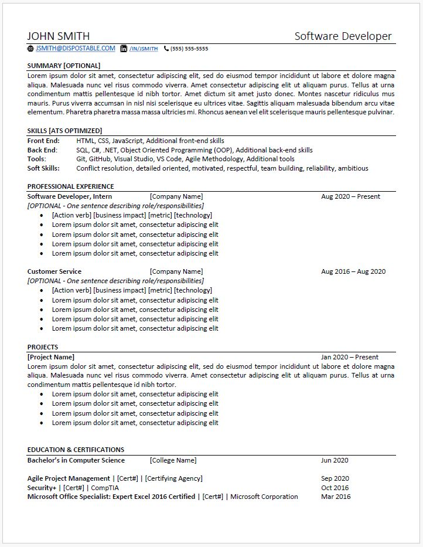

# Workshops

1. [**Introduction**](#intro)
2. [**Data Structures & Algorithms**](#dsa)
3. [**C#/.NET & OOP**](#c-sharp)
4. [**Career Placement**](#career)
5. [**Resources**](#resources)

## Introduction
Welcome to the Workshops homepage. Here you can find the resources for the workshops related to Data Structures & Algorithms, C#/.NET & OOP, and Career Placement. These resources are combined with weekly, live workshops designed to give new software developers the skills to successfully pass interviews and start their career path in development. Data Structures & Algorithms focuses on understanding Big O Notation for time and space complexity, the basics of commonly used data structures, general algorithm patterns, and how to successfully whiteboard these skills in an interview. C#/.NET & OOP focuses on understanding the basics of writing in C#, the basics of object-oriented programming (OOP), how to make models and controllers to connect a React front end to a SQL backend, and answering commonly asked interview questions. Career Placement focuses on creating an ATS-friendly resume, tips for applying to jobs through job boards and company websites, building a strong elevator pitch (aka "tell me about yourself"), mastering the STAR method for behavioral interview questions, and using mock interviews to prepare candidates to land a role as a software developer.

## Data Structures & Algorithms

### Big O Notation

### Data Structures*
| $~~~~~~~~~~~~~~~~~~~~~~~~~~~~~~~~~~~~~~~~~~~~~~~~~~~~~~~~$  | $~~~~~~~~~~~~~~~~~~~~~~~~~~~~~$ Time Complexity $~~~~~~~~~~~~~~~~~~~~~~~~~~$| $~~~~~~~~~~~~~~~~~~~~~~~~~~~~~~~~$ |
| ---- | --- | --- |

| Data Structure | Access | Search | Insert | Delete | Space Complexity |
| ---- | --- | --- | --- | --- | --- |
| [Array](https://en.wikipedia.org/wiki/Array_(data_structure)) | $${\color{green}O(1)}$$ | $${\color{#BCB800}O(n)}$$ | $${\color{#BCB800}O(n)}$$ | $${\color{#BCB800}O(n)}$$ | $${\color{#BCB800}O(n)}$$ |
| [Stack](https://en.wikipedia.org/wiki/Stack_(abstract_data_type)) | $${\color{#BCB800}O(n)}$$ | $${\color{#BCB800}O(n)}$$ | $${\color{green}O(1)}$$ |$${\color{green}O(1)}$$  | $${\color{#BCB800}O(n)}$$ |
| [Queue](https://en.wikipedia.org/wiki/Queue_(abstract_data_type)) | $${\color{#BCB800}O(n)}$$ | $${\color{#BCB800}O(n)}$$ | $${\color{green}O(1)}$$ | $${\color{green}O(1)}$$ | $${\color{#BCB800}O(n)}$$ |
| [LinkedList (singly)](https://en.wikipedia.org/wiki/Linked_list#Singly_linked_lists) | $${\color{#BCB800}O(n)}$$ | $${\color{#BCB800}O(n)}$$ |$${\color{green}O(1)}$$  |$${\color{green}O(1)}$$  | $${\color{#BCB800}O(n)}$$ |
| [LinkedList (doubly)](https://en.wikipedia.org/wiki/Doubly_linked_list) | $${\color{#BCB800}O(n)}$$ | $${\color{#BCB800}O(n)}$$ | $${\color{green}O(1)}$$ | $${\color{green}O(1)}$$ | $${\color{#BCB800}O(n)}$$ |
| [Skip List](https://en.wikipedia.org/wiki/Skip_list) | $${\color{#BCB800}O(n)}$$ | $${\color{#BCB800}O(n)}$$ | $${\color{#BCB800}O(n)}$$ | $${\color{#BCB800}O(n)}$$ | $${\color{darkorange}O(n\space log(n))}$$ |
| [Hash Table](https://en.wikipedia.org/wiki/Hash_table) | $${\color{darkgray}N/A}$$ | $${\color{#BCB800}O(n)}$$ | $${\color{#BCB800}O(n)}$$ | $${\color{#BCB800}O(n)}$$ | $${\color{#BCB800}O(n)}$$ |
| [Binary Search Tree](https://en.wikipedia.org/wiki/Binary_search_tree) | $${\color{#BCB800}O(n)}$$ | $${\color{#BCB800}O(n)}$$ | $${\color{#BCB800}O(n)}$$ | $${\color{#BCB800}O(n)}$$ | $${\color{#BCB800}O(n)}$$ |
| [Cartesian Tree](https://en.wikipedia.org/wiki/Cartesian_tree) | $${\color{darkgray}N/A}$$ | $${\color{#BCB800}O(n)}$$ | $${\color{#BCB800}O(n)}$$ | $${\color{#BCB800}O(n)}$$ | $${\color{#BCB800}O(n)}$$ |
| [B-Tree](https://en.wikipedia.org/wiki/B-tree)  | $${\color{#6CBA04}O(log(n))}$$ | $${\color{#6CBA04}O(log(n))}$$ | $${\color{#6CBA04}O(log(n))}$$ | $${\color{#6CBA04}O(log(n))}$$ | $${\color{#BCB800}O(n)}$$ |
| [Red-Black Tree](https://en.wikipedia.org/wiki/Red%E2%80%93black_tree)  | $${\color{#6CBA04}O(log(n))}$$ | $${\color{#6CBA04}O(log(n))}$$ | $${\color{#6CBA04}O(log(n))}$$ | $${\color{#6CBA04}O(log(n))}$$ | $${\color{#BCB800}O(n)}$$ |
| [Splay Tree](https://en.wikipedia.org/wiki/Splay_tree)  | $${\color{darkgray}N/A}$$ | $${\color{#6CBA04}O(log(n))}$$ | $${\color{#6CBA04}O(log(n))}$$ | $${\color{#6CBA04}O(log(n))}$$ | $${\color{#BCB800}O(n)}$$ |
| [AVL Tree](https://en.wikipedia.org/wiki/AVL_tree)  | $${\color{#6CBA04}O(log(n))}$$ | $${\color{#6CBA04}O(log(n))}$$ | $${\color{#6CBA04}O(log(n))}$$ | $${\color{#6CBA04}O(log(n))}$$ | $${\color{#BCB800}O(n)}$$ |
| [KD Tree](https://en.wikipedia.org/wiki/K-d_tree)  | $${\color{#BCB800}O(n)}$$ | $${\color{#BCB800}O(n)}$$ | $${\color{#BCB800}O(n)}$$ | $${\color{#BCB800}O(n)}$$ | $${\color{#BCB800}O(n)}$$ |
[**Courtesy of Bigocheatsheet.com*](https://www.bigocheatsheet.com/)

[*^ back to top*](#top)

### Array Sorting Algorithms*
| Algorithm | Time Complexity | Space Complexity |
| ---- | --- | --- |
| [Quicksort](https://en.wikipedia.org/wiki/Quicksort) | $${\color{red}O(n^2)}$$ | $${\color{#6CBA04}O(log(n))}$$ |
| [Mergesort](https://en.wikipedia.org/wiki/Merge_sort) | $${\color{darkorange}O(n\space log(n))}$$ | $${\color{#BCB800}O(n)}$$ |
| [Timsort](https://en.wikipedia.org/wiki/Timsort) | $${\color{darkorange}O(n\space log(n))}$$ | $${\color{#BCB800}O(n)}$$ |
| [Heapsort](https://en.wikipedia.org/wiki/Heapsort) | $${\color{darkorange}O(n\space log(n))}$$ | $${\color{green}O(1)}$$ |
| [Bubble Sort](https://en.wikipedia.org/wiki/Bubble_sort) | $${\color{red}O(n^2)}$$ | $${\color{green}O(1)}$$ |
| [Insertion Sort](https://en.wikipedia.org/wiki/Insertion_sort) | $${\color{red}O(n^2)}$$ | $${\color{green}O(1)}$$ |
| [Selection Sort](https://en.wikipedia.org/wiki/Selection_sort) | $${\color{red}O(n^2)}$$ | $${\color{green}O(1)}$$ |
| [Tree sort](https://en.wikipedia.org/wiki/Tree_sort) | $${\color{red}O(n^2)}$$ | $${\color{#BCB800}O(n)}$$ |
| [Shell Sort](https://en.wikipedia.org/wiki/Shellsort) | $${\color{red}O(n\space (log(n))^2)}$$ | $${\color{green}O(1)}$$ |
| [Bucket Sort](https://en.wikipedia.org/wiki/Bucket_sort) | $${\color{red}O(n^2)}$$ | $${\color{#BCB800}O(n)}$$ |
| [Radix Sort](https://en.wikipedia.org/wiki/Radix_sort) | $${\color{green}O(nk)}$$ | $${\color{#BCB800}O(n+k)}$$ |
| [Counting Sort](https://en.wikipedia.org/wiki/Counting_sort) | $${\color{green}O(n+k)}$$ | $${\color{#BCB800}O(k)}$$ |
| [Cubesort](https://en.wikipedia.org/wiki/Cubesort) | $${\color{darkorange}O(n\space log(n))}$$ | $${\color{#BCB800}O(n)}$$ |
[**Courtesy of Bigocheatsheet.com*](https://www.bigocheatsheet.com/)

[*^ back to top*](#top)

## C#/.NET & OOP

### Commonly Used Data Types*
| DataType | Size | Description |
| ---- | --- | --- |
| int	| 4 bytes	| Stores whole numbers from -2,147,483,648 to 2,147,483,647
| long	| 8 bytes	| Stores whole numbers from -9,223,372,036,854,775,808 to 9,223,372,036,854,775,807
| float	| 4 bytes	| Stores fractional numbers. Sufficient for storing 6 to 7 decimal digits
| double | 8 bytes	| Stores fractional numbers. Sufficient for storing 15 decimal digits
| bool	| 1 bit	| Stores true or false values
| char	| 2 bytes	| Stores a single character/letter, surrounded by single quotes
| string	| 2 bytes | per character	Stores a sequence of characters, surrounded by double quotes
[**Courtesy of W3Schools.com*](https://www.w3schools.com/cs/cs_data_types.php)

[*^ back to top*](#top)

## Career

### Resume Template

[*^ back to top*](#top)

## Resources
| Website | Type | Resources |
| --- | --- | --- |
| [Big O Chart](https://www.bigocheatsheet.com/) | Data Structures & Algorithms | Big O Cheat Sheets |
| [STAR Method - Indeed](https://www.indeed.com/career-advice/interviewing/how-to-use-the-star-interview-response-technique) | Career | STAR method techniques |
| [ATS Tips - Indeed](https://www.indeed.com/career-advice/resumes-cover-letters/ats-resume-template) | Career | ATS tips and techniques |
| [ATS Tips - LinkedIn](https://premium.linkedin.com/content/premium/global/en_us/index/jobsearch/articles/the-easy-how-to-guide-for-formatting-resumes-for-applicant-tracking-systems) | Career | ATS tips and techniques |
| [ATS Tips - MasterClass](https://www.masterclass.com/articles/ats-resume) | Career | ATS tips and techniques |
| [Bullet Points - Indeed](https://www.masterclass.com/articles/ats-resume) | Career | Resume bullet point tips |
| [Bullet Points - Columbia](https://www.masterclass.com/articles/ats-resume) | Career | Resume bullet point tips |

[*^ back to top*](#top)
